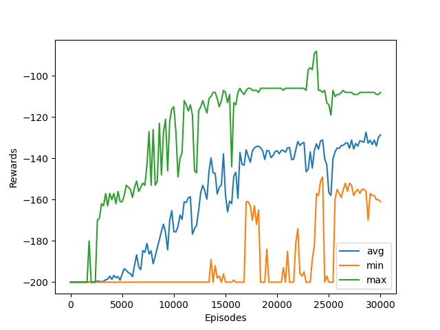
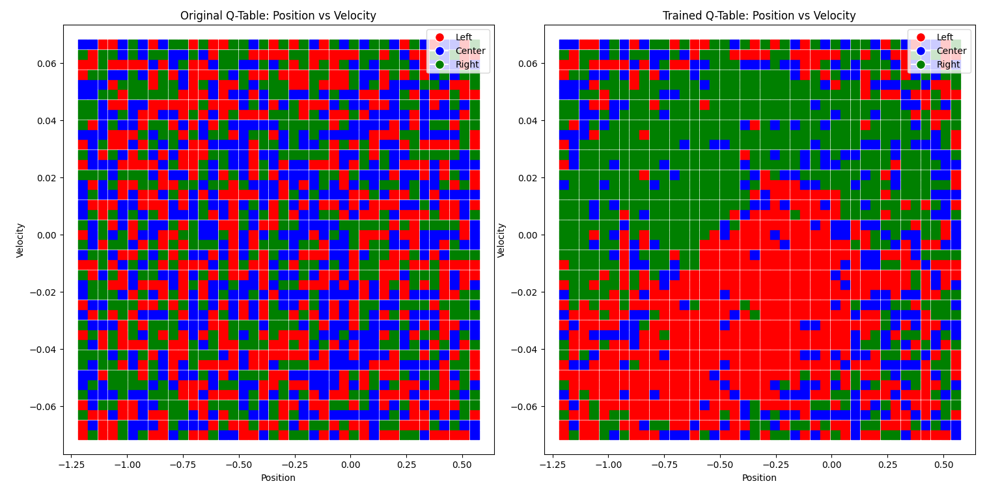

```markdown
# MountainCar-v0 Q-Learning Agent

This project implements a Q-Learning agent to solve the `MountainCar-v0` environment from OpenAI's Gymnasium library. The agent learns to drive a car up a hill by optimizing its actions using a Q-table. The implementation includes visualization of the training process and analysis of the trained Q-table.

---

## **Overview**

The `MountainCar-v0` environment involves controlling an underpowered car stuck between two hills. The goal is to drive the car to the flag at the top of the right hill by building momentum. The agent learns through Q-Learning, a model-free reinforcement learning algorithm, by iteratively updating a Q-table that maps state-action pairs to expected rewards.

---

## **Implementation Details**

### **Key Features**
- **Q-Learning Algorithm**: The agent uses a discrete state space and updates its Q-values based on the Bellman equation.
- **Exploration vs Exploitation**: An epsilon-greedy strategy is employed to balance exploration and exploitation.
- **Visualization**: 
  - Rewards over episodes are plotted to monitor training progress.
  - Visualization of the Q-table before and after training shows how the agent's policy evolves.

### **Constants**
- `LEARNING_RATE`: Controls how much new information overrides old knowledge.
- `DISCOUNT`: Determines the importance of future rewards.
- `EPSILON`: Initial exploration rate, gradually decayed over episodes.
- `EPISODES`: Total number of episodes for training.
- `SHOW_EVERY`: Frequency of rendering and plotting during training.

---

## **Results**

### **Rewards Plot**

The following plot shows the average, minimum, and maximum rewards over training episodes:



- **Analysis**: 
  - Initially, rewards are low as the agent explores random actions.
  - Over time, as the agent learns an optimal policy, average rewards increase, indicating improved performance.
  - The decrease in variability (min and max) suggests convergence towards consistent behavior.

### **Policy Visualization**





- **Analysis**:
  - The original Q-table is initialized with random values, resulting in no meaningful policy.
  - After training, distinct patterns emerge in the trained Q-table, reflecting optimal actions (left, center, or right) for each state. These patterns correspond to the agent's learned strategy for building momentum and reaching the goal.

---

## **How to Run**

1. Install dependencies:
   ```
   pip install gymnasium numpy matplotlib tqdm
   ```
2. Run the script:
   ```
   python q_learning.py
   ```
3. Visualizations will be displayed automatically after training.

---

## **Code Structure**

- `run()`: Main function that trains the agent and plots results.
- `get_discrete_state(env, state, discrete_os_win_size)`: Converts continuous states into discrete states for indexing in the Q-table.
- `plot_best_action(q_table, q_original, env, discrete_os_size, discrete_os_win_size)`: Visualizes the best actions from the original and trained Q-tables.

---

## **Future Improvements**
- Implement dynamic exploration strategies like decaying epsilon based on performance rather than fixed episodes.
- Test with different discretization levels for state space to optimize learning efficiency.
- Extend to other environments or use function approximation methods like Deep Q-Learning.

---

## **Acknowledgments**
This project uses OpenAI's Gymnasium library for simulating reinforcement learning environments. Special thanks to contributors of open-source tools like NumPy, Matplotlib, and TQDM used in this project.
```